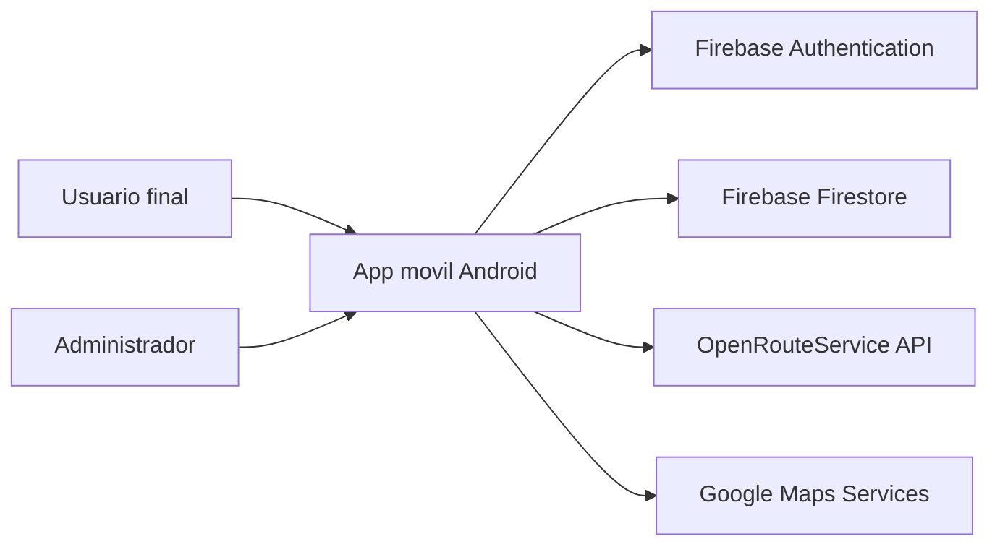
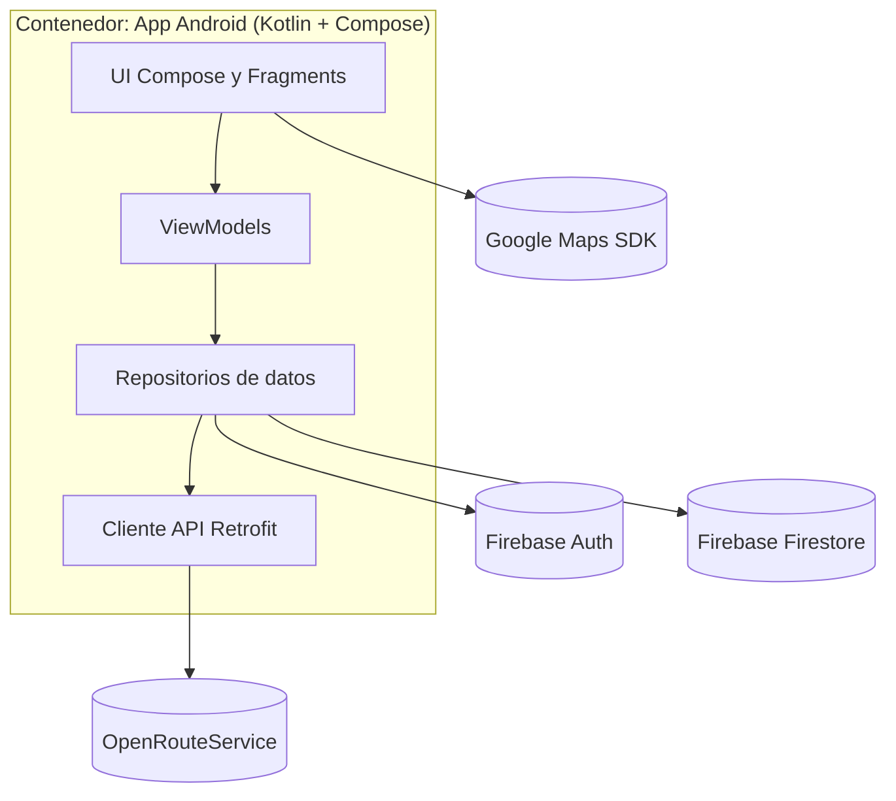
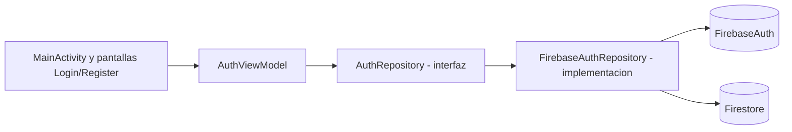
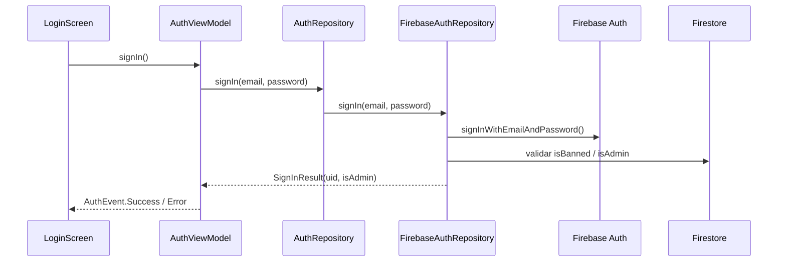

# Modelo C4 de la aplicacion movil

## Nivel 1 - Contexto del sistema

## Nivel 2 - Contenedores

## Nivel 3 - Componentes (modulo autenticacion mejorado)

## Nivel 4 - Codigo (ejemplo de interaccion)

## Comparacion rapida: C4 antes vs despues

- **Antes:** UI/ViewModel dependian en gran medida de Firebase directo.
- **Despues:** se introduce una abstraccion (`AuthRepository`) y un adaptador de infraestructura (`FirebaseAuthRepository`).
- **Efecto:** disminuye acoplamiento y mejora capacidad de pruebas por sustitucion de implementaciones.
